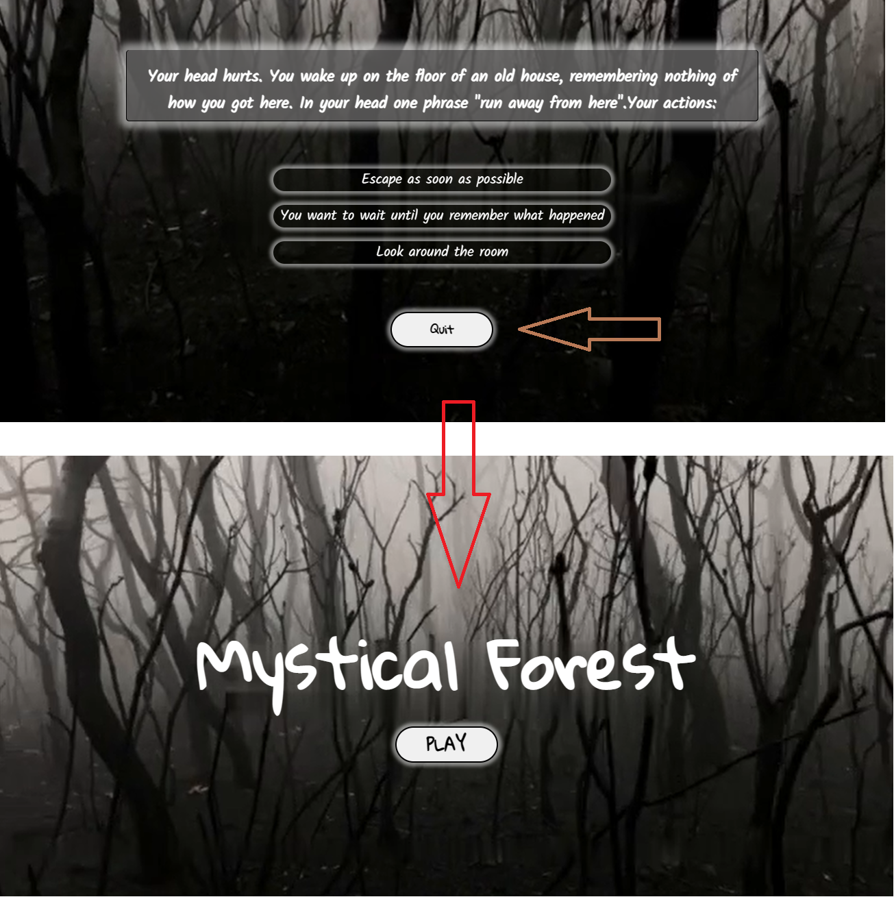

# Escape quiz "Mystical Forest"
(Developer: Kristina Orlichenko github: Kristaal)

[Live webpage](https://kristaal.github.io/Escape-Quiz-Mystical-Forest-/)

## Table of content

1. [Project Goals](#project-goals)
    1. [User Goals](#user-goals)
    2. [Site Owner Goals](#site-owner-goals)
2. [User Experience](#user-experience)
    1. [Target Audience](#target-audience)
    2. [User Requirements and Expectations](#user-requirements-and-expectations)
    3. [User Stories](#user-stories)
    4. [Site Owner Stories](#site-owner-stories)
3. [Design](#design)
    1. [Design Choices](#design-choices)
    2. [Colour](#colours)
    3. [Fonts](#fonts)
    4. [Structure](#structure)
    5. [Wireframes](#wireframes)
4. [Technologies Used](#technologies-used)
    1. [Languages](#languages)
    2. [Frameworks & Tools](#frameworks-&-tools)
5. [Features](#features)
6. [Testing](#validation)
    1. [HTML Validation](#HTML-validation)
    2. [CSS Validation](#CSS-validation)
    3. [JavaScript Validation](#javascript-validation)
    4. [Accessibility](#accessibility)
    5. [Performance](#performance)
    6. [Device testing](#performing-tests-on-various-devices)
    7. [Browser compatibility](#browser-compatability)
    8. [Testing user stories](#testing-user-stories)
8. [Bugs](#Bugs)
9. [Deployment](#deployment)
10. [Credits](#credits)
11. [Acknowledgments](#acknowledgments)

## Project Goals
The Mystical Forest is a classic survival quiz,with which you can check your logic and intuition. All answers will affect the result and give a chance to escape.

## User Goals
- Play an exciting survival game-quiz;
- Test your logic and intuition by answering different quiz questions;
- Immerse yourself in the atmosphere of a scary forest with secrets.

## Site Owner Goals
- Creating engaging survival game-quiz, that users will want to play again;
- The game-quiz shoud be fully responsive for different devices, work well and have a logical calculation of the quiz result.

## Target Audience
- People, who like quiz;
- People, who like horror games;
- People, who like survival games;
- Casual gamers;
- People, looking for a quick and engaging game.

## User Requirement and Expectations
- Visually appealing and exiting design that matches the theme of the game;
- Quick and easy to play;
- Simple and function navigation  system;
- Function that work as expected;
- Fully responsive quiz regardless of screen size.

## User Stories
1. As a user, I want to start the game;
2. As a user, I want to read general rules of this game or how I should play it;
3. As a user, after reading rules, I want to start the quiz and check my logic;
4. As a user, I want to be able to exit the game at any time;
5. As a user, I want to complete all the quiz questions;
6. As a user, I want to be able to choose from answers;
7. As a user, I want to get the result of my answers;
8. As a user, I want to start the game again.

## Design

### Design Choices
The game has been designed to have an exciting and scaring effect on the user. The video as a background was chosen to show the emotions of being in a scary forest and trying to escape and survive. The entire design of the game is based on the atmosphere of the classic horror film.

### Colour
The color palette was chosen to match the horror theme of the background video. A color picker was used to pick colors from the background video, these colors were then further adjusted to meet accessibility criteria and added accent color.

Colour palette

 

### Fonts
On the platform Google fonts a font "Gloria Hallelujah" was chosen, because the name of the quiz-game would look unusually, frightening and handwriting. I chose "Kalam" font for readability questions and answers.

### Structure
The page structure is user friendly and simple.  When entering the site, the user sees a proposal to start the game. The site consists of one page which changes depending on the function:
- A home page with name of the game and button "Start";
- A rules page, whick shows rules of the game for user;
- A question page with quiz;
- A result page, that shows the result of the game.

Start screen

Rules screen

Quiz screen

Result screen

## Technologies Used

### Languages
- HTML
- CSS
- JavaScript

### Frameworks & Tools

- GitHub
- Gitpod
- Paint
- Gettyimages.ie
- Balsamiq
- Font Awesome
- JSHint
- Lighthouse
- W3C Markup validation service
- W3C Jigsaw CSS validation service 
- WAVE WebAIM web accessibility evaluation tool

## Features
The site consists of four pages 

### Start screen
- Provides an option to start the game
- User story covered: 1

Start screen

### Rules screen
- Provides an option to expain the rules of the game and use buttons go to the next page with quiz;
- User story covered: 2

Rules screen

### Quiz screen

- Consists of 3 different sections:
    - Headindg with question;
    - Three answers that works as buttons and send you to another question;
    - Button "exit", that return you home;
- User stories covered: 3

Quiz screen

### Result screen
- Consists of two sections
    - A section with the current result after comliting quiz;
    - Buttons "play again" that send user on start screen;
- User stories covered: 7

Result screen

## Validation

### HTML Validation
The W3C Markup Validation Service was used to validate the HTML of the website. File passed with no errors no warnings to show.

Result

### CSS Validation
The W3C Jigsaw CSS Validation Service was used to validate the CSS of the website. File passed with no errors no warnings to show.

Result

### JavaScript Validation
JSHint Static Code Analysis Tool for JavaScript was used to validate the Javascript files. No significant issues were found.

Result

### Accessibility
The WAVE WebAIM web accessibility evaluation tool was used to ensure the website met high accessibility standards. All pages pass with 0 errors.

Result

### Performance 
Google Lighthouse in Google Chrome Developer Tools was used to test the performance of the website.

Result for mobile

Result for desktop

### Performing tests on various devices 
The website was tested on the following devices:

- Iphone 14;
- Lenovo ThinkPad;
- IPad Air.

### Browser Compatability
The website was tested on the following browsers:

- Google Chrome;
- Safari;
- Microsoft Edge.

### Testing user stories

1. As a user, I want to start the game

| **Feature** | **Action** | **Expected Result** | **Actual Result** |
|-------------|------------|---------------------|-------------------|
| Start screen | Click on button "Play" | The button send user to the next page and start the game | Works as expected |

Screenshots

 
2. As a user, I want to read general rules of this game or how I should play it

| **Feature** | **Action** | **Expected Result** | **Actual Result** |
|-------------|------------|---------------------|-------------------|
| Start screen | Click on button "Play" | The button send user to the next page and shows the rules screen| Works as expected |

Screenshots

 

3. As a user, after reading rules, I want to start the quiz and check my logic

| **Feature** | **Action** | **Expected Result** | **Actual Result** |
|-------------|------------|---------------------|-------------------|
| Rules screen | Click on button "Continue" | The button send user to the quiz screen| Works as expected |

Screenshots

 
4. As a user, I want to be able to exit the game at any time

| **Feature** | **Action** | **Expected Result** | **Actual Result** |
|-------------|------------|---------------------|-------------------|
| Quiz screen | Click on button "quit" | The button send user to the start screen| Works as expected |

Screenshots

 
5. As a user, I want to complete all the quiz questions

| **Feature** | **Action** | **Expected Result** | **Actual Result** |
|-------------|------------|---------------------|-------------------|
| Quiz screen | Click on offered answers  | Each answer send you to another question| Works as expected |

Screenshots

 
6. As a user, I want to be able to choose from answers

| **Feature** | **Action** | **Expected Result** | **Actual Result** |
|-------------|------------|---------------------|-------------------|
| Quiz screen | Click on offered answers | You have multiple answers and each works and send you to another question| Works as expected |

Screenshots

 
7. As a user, I want to get the result of my answers

| **Feature** | **Action** | **Expected Result** | **Actual Result** |
|-------------|------------|---------------------|-------------------|
| Quiz screen | Click on offered answers | After clicking on the selected answers the result of the quiz will appear| Works as expected |

Screenshots

 
8. As a user, I want to start the game again

| **Feature** | **Action** | **Expected Result** | **Actual Result** |
|-------------|------------|---------------------|-------------------|
| Result screen | Click on button "Play Again" | The button send user to the start screen| Works as expected |

Screenshots

 

## Bugs

| **Bug** | **Fix** |
| ----------- | ----------- |
| The video that I used as background showed controls panels | Delete "control" from html file |
| Button "Continue" don't sent user to another page | Fix function .addEventListener in JS file |
| Result and Rules screens are not responsive on mobile| Add media queries for max-width: 280px |
| Answers looks like list item with small circle near each |  Add to css file style for list "list-style-type: none"

## Deployment
The website was deployed using GitHub Pages by following these steps:
1. In the GitHub repository navigate to the Settings tab
2. On the left hand menu select Pages
3. For the source select Branch: main
4. After the webpage refreshes automaticaly you will se a ribbon on the top saying:
 Your site is live at https://kristaal.github.io/Escape-Quiz-Mystical-Forest-/

You can for fork the repository by following these steps:
1. Go to the GitHub repository
2. Click on Fork button in upper right hand corner

You can clone the repository by following these steps:
1. Go to the GitHub repository 
2. Locate the Code button above the list of files and click it 
3. Select if you prefere to clone using HTTPS, SSH, or Github CLI and click the copy button to copy the URL to your clipboard
4. Open Git Bash
5. Change the current working directory to the one where you want the cloned directory
6. Type git clone and paste the URL from the clipboard ($ git clone https://github.com/YOUR-USERNAME/YOUR-REPOSITORY)
7. Press Enter to create your local clone.

## Credits

### Media
In order of apearance:
- [background](assets/img/videoback.mp4): Video by <a href="https://www.gettyimages.ie/detail/video/walking-in-atmospheric-burnt-forest-after-bush-fire-bare-stock-footage/1278929981?adppopup=true">Andrew Merry</a> on <a href="https://www.gettyimages.ie/detail/video/walking-in-atmospheric-burnt-forest-after-bush-fire-bare-stock-footage/1278929981?adppopup=true">Gettyimages.ie</a>

### Code
- Code Institute for the Gitpod template provided at https://github.com/Code-Institute-Org/gitpod-full-template allowing easy set up of a repository and workspace s well as initial project HTML template;
- Font Awesome for social media icons;
- Google Fonts for imported text fonts;
- Different YouTube chanels for creating quiz.

## Acknowledgements
I would like to take the opportunity to thank:
- My mentor Spencer Barriball for his help, advice and support.
- To the lovely people on the Code Institute Slack for providing peer code reviews.
- To my colleagues with whom I study who helped solve problems together
